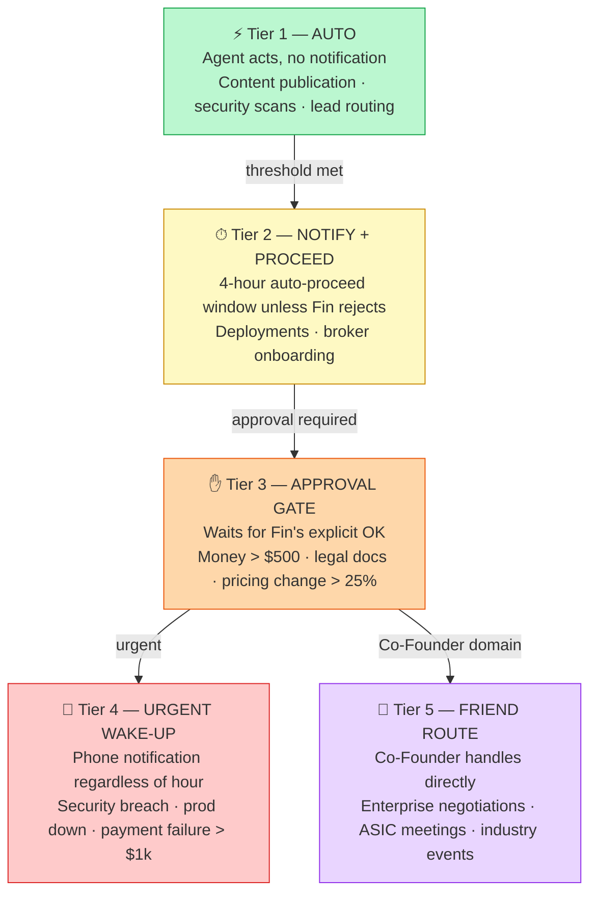
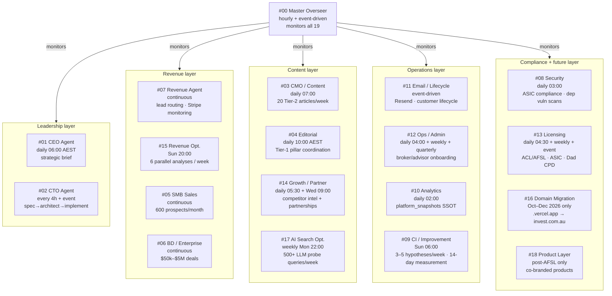

# Agent System Topology

19 agents · 5 escalation tiers · 24 infrastructure tables.

> Source of truth: `COMPANY.md` §"The 19 agents" + §"24 agent infrastructure tables".
> Specs: `.claude/agents/*.md` (precedence: spec > this doc).
> Queue item: S-02.

---

## 5-tier escalation hierarchy

**Bandwidth modifiers:** Master Overseer (#00) reads Fin's + Co-Founder's Google Calendars.
During low-bandwidth windows (Vipassana retreats, treks) tier-2 escalations are downgraded.
Tier-4 always breaks through.

---

## Agent network

---

## Agent → DB table linkages

### Agent-only tables (19, all `service_role`-only RLS)

| Group | Tables | Primary agents |
|---|---|---|
| Core runtime | `agent_tasks`, `agent_memory`, `agent_logs` | all agents via #00 Overseer |
| Observability | `platform_snapshots` | #10 Analytics |
| Sales & growth | `prospects`, `revenue_opportunities`, `partner_integrations` | #05 SMB Sales, #06 BD, #14 Growth |
| Compliance & licensing | `compliance_tasks`, `authorised_representatives`, `credit_representatives` | #08 Security, #13 Licensing |
| Approvals & bandwidth | `ceo_approvals`, `friend_decisions`, `founder_bandwidth` | #00 Overseer (writes), #01 CEO (reads) |
| Editorial | `editorial_articles`, `advisor_content_subscriptions` | #03 CMO, #04 Editorial |
| Search & migration | `llm_citations`, `migration_plan` | #17 AI Search, #16 Domain Migration |
| Products & API | `cobranded_products`, `api_customers` | #18 Product Layer (post-AFSL) |

### Shared platform tables (5, agents co-use with app)

| Platform table | Agent using it | Purpose |
|---|---|---|
| `ab_tests` | #09 CI / Improvement | A/B test lifecycle management |
| `forum_threads` | #03 CMO / Content, #04 Editorial | Article discussion seeding |
| `bd_pipeline` | #06 BD / Enterprise | Enterprise deal tracking |
| `competitor_watch` | #14 Growth / Partnership | Competitive intelligence |
| `dynamic_pricing_rules` | #15 Revenue Optimisation | Price elasticity experiments |

---

## Escalation routing by agent

| Agent | Primary trigger | Normal tier | Escalates to |
|---|---|---|---|
| #00 Master Overseer | hourly + event | — | T4 (anomaly detected) |
| #01 CEO Agent | daily 06:00 | T1 (brief) | T3 (strategic decisions) |
| #02 CTO Agent | every 4h + event | T1/T2 (deploys) | T3 (schema changes, pricing) |
| #03 CMO / Content | daily 07:00 | T1 (publish) | T2 (new content type) |
| #04 Editorial | daily 10:00 | T2 (Tier-1 article brief) | T3 (legal-sensitive content) |
| #05 SMB Sales | continuous | T1 (outreach) | T3 (contract > $500) |
| #06 BD / Enterprise | continuous | T2 (pipeline updates) | T5 (enterprise negotiations) |
| #07 Revenue Agent | continuous | T1 (lead routing) | T4 (Stripe anomaly > $1k) |
| #08 Security | daily 03:00 | T1 (scan + patch) | T4 (breach detected) |
| #09 CI / Improvement | Sun 06:00 | T2 (hypothesis brief) | T3 (breaking change) |
| #10 Analytics | daily 02:00 | T1 (snapshot write) | T2 (anomaly report) |
| #11 Email / Lifecycle | event-driven | T1 (automated email) | T2 (new campaign type) |
| #12 Ops / Admin | daily 04:00 | T1 (onboarding) | T2 (billing issue) |
| #13 Licensing | daily 04:30 | T1 (monitoring) | T4 (ASIC action) |
| #14 Growth / Partner | daily 05:30 | T1/T2 (intel + pipeline) | T5 (partner deal) |
| #15 Revenue Opt. | Sun 20:00 | T2 (opportunity brief) | T3 (pricing change > 25%) |
| #16 Domain Migration | Oct–Dec 2026 | T2 (migration steps) | T4 (authority drop detected) |
| #17 AI Search Opt. | weekly Mon 22:00 | T1 (probe + report) | T2 (citation strategy change) |
| #18 Product Layer | post-AFSL | T3 (product decisions) | joint Fin+Co-Founder approval |

---

## Forbidden actions (all agents)

- Direct DB writes outside CTO Agent path
- Force-push to `main`
- Stripe refunds without approval
- Email impersonation of real people (except authorised authors)
- Content publication without compliance check
- Schema changes without approval
- Security feature disablement
- Licensing work suspension
- Co-branded product changes without joint Fin + Co-Founder approval
- ASIC communication without Master Agent review
