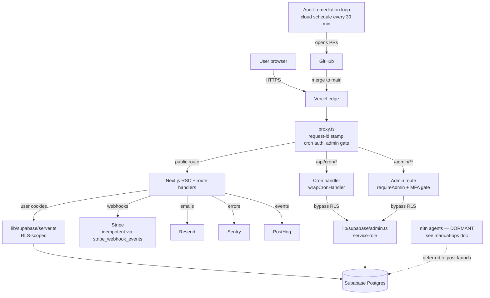

# Architecture overview

> The "if I disappear tomorrow" doc. Every other architecture document in
> this repo (`ARCHITECTURE.md`, the runbooks, the audit reports) goes deeper.
> This one is the **5-minute version** that lets a new engineer (or the
> founder coming back after a break) orient themselves before opening any
> other file.

## What this is

`invest-com-au` is a pre-launch Australian retail-investor platform. Two
sides of the marketplace:

- **Consumers** — research advisors, brokers, ETFs, calculators. Capture
  leads via forms.
- **Advisors** — pay subscriptions, get matched leads, manage their listing.

Launch trigger is **ACL approval**, expected Oct–Dec 2026. Pre-launch
hardening runs through a mostly-autonomous audit-remediation loop (see
below).

## Request lifecycle (one diagram)

## The 5 most important files

| File | Why it matters |
|---|---|
| `proxy.ts` | The single edge entry point. Stamps request IDs, validates `CRON_SECRET` Bearer, gates `/admin/**` (and the MFA cookie once V-NEW-07 is wired), unifies CSP / X-Frame / Permissions-Policy headers. **Not** named `middleware.ts` — there used to be a duplicate, removed in `1fead77`. |
| `lib/supabase/admin.ts` | Service-role escape hatch. Bypasses RLS. Use **only** in admin routes, webhooks, cron. ESLint rule prevents `app/**/page.tsx` from importing it (Stream X). |
| `lib/compliance.ts` | Single source of truth for AFSL / GDPR / disclosure copy. If you write a fresh disclaimer string anywhere, you missed the helper. |
| `app/api/cron/dispatch/[group]/route.ts` | The cron fan-out dispatcher. Was at `_dispatch/` until PR #270 — Next.js treats `_`-prefixed folders as **private** (excluded from routing). 12 days of cron silence taught us this. Don't rename it back. |
| `lib/database.types.ts` | Generated from Supabase. Source of truth for table shapes. Drift here = drift everywhere. |

## Three things that surprise new engineers

1. **The middleware is `proxy.ts`, not `middleware.ts`.** Standard Next.js
   convention is `middleware.ts`; this repo deliberately named it `proxy.ts`
   to avoid a duplicate. The thing that runs on every edge request lives
   there.

2. **Folders prefixed with `_` are Next.js "private folders" — they don't
   become routes.** This was the root cause of the 04-16 → 04-26 cron
   silence. The dispatcher lived at `_dispatch/` and Next.js silently
   excluded it from the build. `proxy.ts` matched the prefix, validated the
   bearer, returned `NextResponse.next()` → empty 200. No alert, no log
   row, just silence. Documented in `app/api/cron/dispatch/[group]/route.ts`
   header.

3. **TypeScript strict + `noUncheckedIndexedAccess`.** `arr[0]` is
   `T | undefined`. The build will fail on non-null assertions. CI has
   no `ignoreBuildErrors` escape hatch. Get used to `?` and explicit
   guards.

## How work happens — the audit loop

There's no traditional sprint board. Most work flows through a
**remediation queue** (`docs/audits/REMEDIATION_QUEUE.md`) and is shipped
by a **cloud-scheduled audit-loop** that runs every 30 minutes. Each
iteration:

1. Reads the queue.
2. Picks the highest-priority unblocked item.
3. Opens or updates a stream branch (e.g. `claude/audit-remediation/d-route-tests`).
4. Implements the item.
5. Commits + pushes + opens or updates a draft PR.
6. Logs the iteration to `docs/audits/LOOP_PROGRESS.md`.

The founder is the merger. Auto-merge handles `auto-merge-safe`-labeled
PRs; everything else needs a human click.

This is why most commits look like `chore(audit): queue update — iter 81,
D-11 batch 14 done`. Don't block on understanding the names; read
`docs/audits/REMEDIATION_QUEUE.md` for the stream legend.

## The 5 things that are most load-bearing right now

These are the things most likely to break in surprising ways. If something
goes wrong in production, look here first.

1. **Cron silence.** Dispatcher path got renamed in #270 + Vercel
   billing/quota issue. If `cron_run_log` is empty for >1h, see
   `docs/runbooks/cron-silence-alert.md`.
2. **Stripe webhook idempotency.** Replay-safe via `stripe_webhook_events`
   table. CI gate (V-NEW-03) blocks new webhook handlers without idempotency
   tests. Don't write a webhook without one.
3. **RLS policies.** ~76% → ~90% coverage as B-stream and O-stream land.
   Any new user-data table without RLS = silent data leak. CI gate
   (V-NEW-04) blocks migrations that miss this.
4. **CSP + admin MFA.** K-stream removed `unsafe-inline` from `script-src`;
   V-NEW-07 added a proxy-level MFA gate. Both load-bearing for security.
   Adding inline scripts will silently break in CSP3 browsers.
5. **AI surface — DORMANT.** `lib/ai-cost-caps.ts` is wired but the AI
   features themselves are deferred to post-launch (see
   `docs/launch/manual-ops-during-ai-pause.md`). Don't ship AI code without
   a feature flag.

## Where to find things

| You need | Look here |
|---|---|
| The big-picture architecture (full version) | `ARCHITECTURE.md` |
| What the company does and what compliance constraints apply | `COMPANY.md` |
| Coding conventions, commit format, single-source-of-truth helpers | `CLAUDE.md`, `CONTRIBUTING.md` |
| The remediation queue (current sprint of work) | `docs/audits/REMEDIATION_QUEUE.md` |
| The 4-month sprint plan to launch | `docs/audits/2026-04-26-comprehensive-audit.md` §"4-month plan" |
| Per-surface quality standard | `docs/audits/ENTERPRISE_STANDARD.md` |
| Incident runbooks | `docs/runbooks/` |
| Why the AI surface is dormant | `docs/launch/manual-ops-during-ai-pause.md` |
| Glossary (AFSL, ACL, AFCA, etc.) | `docs/glossary.md` |
| The Friday ritual (what to do every week) | `docs/runbooks/friday-ritual.md` |

## Onboarding day 1

If you've just been pointed at this repo, follow `docs/runbooks/onboarding-day-1.md`.
8 hours, end-to-end, gets you productive.
