# KK-03 Topic Cluster Map

**Date:** 2026-05-10  
**Script:** `scripts/topic-cluster-map.mjs`  
**Queue item:** KK-03 — Topic cluster map (pillar ↔ cluster ↔ supporting)  
**Audit ref:** `docs/audits/codebase-health-2026-04-24.md` §5 (SEO + discoverability)

---

## Summary

| Metric | Count |
|--------|-------|
| Hub pillar pages | 15 |
| Cluster pages (direct sub-topics) | 61 |
| Supporting pages (cross-hub links) | 67 |
| Total unique paths in cluster map | 88 |

---

## Hub cluster overview

| Pillar | Label | Clusters | Supporting |
|--------|-------|----------|------------|
| `/foreign-investment` | Foreign Investment | 9 | 4 |
| `/calculators` | Calculators Hub | 16 | 5 |
| `/compare` | Comparison Hub | 2 | 5 |
| `/etfs` | ETFs Hub | 3 | 4 |
| `/invest` | Investing Hub | 7 | 5 |
| `/insurance` | Insurance Hub | 6 | 3 |
| `/smsf` | SMSF Hub | 2 | 6 |
| `/super` | Superannuation Hub | 2 | 4 |
| `/tax` | Tax Hub | 2 | 5 |
| `/property` | Property Hub | 1 | 6 |
| `/advisors` | Advisors Hub | 3 | 7 |
| `/research` | Research Hub | 4 | 3 |
| `/startup` | Startup Hub | 1 | 3 |
| `/lump-sum-investing` | Lump-Sum Investing Hub | 2 | 3 |
| `/dividends` | Dividends Hub | 1 | 4 |

---

## Cluster map (Mermaid diagram)

Solid arrows (→) = pillar → direct cluster sub-page.  
Dashed arrows (⇢) = cross-hub structural links between pillars.

```mermaid
flowchart TD
  foreign-investment["🏛️ Foreign Investment\n/foreign-investment"]:::pillar
  foreign-investment_siv["Siv"]:::cluster
  foreign-investment --> foreign-investment_siv
  foreign-investment_property["Property"]:::cluster
  foreign-investment --> foreign-investment_property
  foreign-investment_tax["Tax"]:::cluster
  foreign-investment --> foreign-investment_tax
  foreign-investment_united-arab-emirates["United Arab Emirates"]:::cluster
  foreign-investment --> foreign-investment_united-arab-emirates
  foreign-investment_hong-kong["Hong Kong"]:::cluster
  foreign-investment --> foreign-investment_hong-kong
  foreign-investment_new-zealand["New Zealand"]:::cluster
  foreign-investment --> foreign-investment_new-zealand
  foreign-investment_guides_firb-guide["Firb Guide"]:::cluster
  foreign-investment --> foreign-investment_guides_firb-guide
  foreign-investment_guides_siv-guide["Siv Guide"]:::cluster
  foreign-investment --> foreign-investment_guides_siv-guide
  foreign-investment_guides_property-guide["Property Guide"]:::cluster
  foreign-investment --> foreign-investment_guides_property-guide
  calculators["🏛️ Calculators Hub\n/calculators"]:::pillar
  mortgage-calculator["Mortgage Calculator"]:::cluster
  calculators --> mortgage-calculator
  super-contributions-calculator["Super Contributions Calculator"]:::cluster
  calculators --> super-contributions-calculator
  retirement-calculator["Retirement Calculator"]:::cluster
  calculators --> retirement-calculator
  debt-calculator["Debt Calculator"]:::cluster
  calculators --> debt-calculator
  fire-calculator["Fire Calculator"]:::cluster
  calculators --> fire-calculator
  property-vs-shares-calculator["Property Vs Shares Calculator"]:::cluster
  calculators --> property-vs-shares-calculator
  smsf-calculator["Smsf Calculator"]:::cluster
  calculators --> smsf-calculator
  dividend-reinvestment-calculator["Dividend Reinvestment Calculator"]:::cluster
  calculators --> dividend-reinvestment-calculator
  cgt-calculator["Cgt Calculator"]:::cluster
  calculators --> cgt-calculator
  fee-simulator["Fee Simulator"]:::cluster
  calculators --> fee-simulator
  fee-tracker["Fee Tracker"]:::cluster
  calculators --> fee-tracker
  dividend-calculator["Dividend Calculator"]:::cluster
  calculators --> dividend-calculator
  savings-calculator["Savings Calculator"]:::cluster
  calculators --> savings-calculator
  switching-calculator["Switching Calculator"]:::cluster
  calculators --> switching-calculator
  fee-impact["Fee Impact"]:::cluster
  calculators --> fee-impact
  borrowing-power-calculator["Borrowing Power Calculator"]:::cluster
  calculators --> borrowing-power-calculator
  compare["🏛️ Comparison Hub\n/compare"]:::pillar
  compare_etfs["Etfs"]:::cluster
  compare --> compare_etfs
  compare_insurance["Insurance"]:::cluster
  compare --> compare_insurance
  etfs["🏛️ ETFs Hub\n/etfs"]:::pillar
  etfs_bonds["Bonds"]:::cluster
  etfs --> etfs_bonds
  etfs_international["International"]:::cluster
  etfs --> etfs_international
  etfs_sectors["Sectors"]:::cluster
  etfs --> etfs_sectors
  invest["🏛️ Investing Hub\n/invest"]:::pillar
  invest_bonds["Bonds"]:::cluster
  invest --> invest_bonds
  invest_commodities["Commodities"]:::cluster
  invest --> invest_commodities
  invest_forex["Forex"]:::cluster
  invest --> invest_forex
  invest_alternatives["Alternatives"]:::cluster
  invest --> invest_alternatives
  invest_alternatives_guides["Guides"]:::cluster
  invest --> invest_alternatives_guides
  invest_digital-infrastructure["Digital Infrastructure"]:::cluster
  invest --> invest_digital-infrastructure
  invest_startups["Startups"]:::cluster
  invest --> invest_startups
  insurance["🏛️ Insurance Hub\n/insurance"]:::pillar
  insurance_health["Health"]:::cluster
  insurance --> insurance_health
  insurance_life["Life"]:::cluster
  insurance --> insurance_life
  insurance_income-protection["Income Protection"]:::cluster
  insurance --> insurance_income-protection
  insurance_total-and-permanent-disability["Total And Permanent Disability"]:::cluster
  insurance --> insurance_total-and-permanent-disability
  insurance_trauma["Trauma"]:::cluster
  insurance --> insurance_trauma
  insurance_business["Business"]:::cluster
  insurance --> insurance_business
  smsf["🏛️ SMSF Hub\n/smsf"]:::pillar
  smsf_checklist["Checklist"]:::cluster
  smsf --> smsf_checklist
  smsf_crypto["Crypto"]:::cluster
  smsf --> smsf_crypto
  super["🏛️ Superannuation Hub\n/super"]:::pillar
  super_consolidation["Consolidation"]:::cluster
  super --> super_consolidation
  super_leaving-australia["Leaving Australia"]:::cluster
  super --> super_leaving-australia
  tax["🏛️ Tax Hub\n/tax"]:::pillar
  tax_crypto["Crypto"]:::cluster
  tax --> tax_crypto
  tax_negative-gearing["Negative Gearing"]:::cluster
  tax --> tax_negative-gearing
  property["🏛️ Property Hub\n/property"]:::pillar
  property_buyer-agents["Buyer Agents"]:::cluster
  property --> property_buyer-agents
  advisors["🏛️ Advisors Hub\n/advisors"]:::pillar
  advisors_financial-planners["Financial Planners"]:::cluster
  advisors --> advisors_financial-planners
  advisors_accountants["Accountants"]:::cluster
  advisors --> advisors_accountants
  advisors_mortgage-brokers["Mortgage Brokers"]:::cluster
  advisors --> advisors_mortgage-brokers
  research["🏛️ Research Hub\n/research"]:::pillar
  research-tools["Research Tools"]:::cluster
  research --> research-tools
  health-scores["Health Scores"]:::cluster
  research --> health-scores
  benchmark["Benchmark"]:::cluster
  research --> benchmark
  chess-lookup["Chess Lookup"]:::cluster
  research --> chess-lookup
  startup["🏛️ Startup Hub\n/startup"]:::pillar
  startup_grants["Grants"]:::cluster
  startup --> startup_grants
  lump-sum-investing["🏛️ Lump-Sum Investing Hub\n/lump-sum-investing"]:::pillar
  lump-sum-investing_inheritance["Inheritance"]:::cluster
  lump-sum-investing --> lump-sum-investing_inheritance
  lump-sum-investing_redundancy["Redundancy"]:::cluster
  lump-sum-investing --> lump-sum-investing_redundancy
  dividends["🏛️ Dividends Hub\n/dividends"]:::pillar
  dividends_franking-credits["Franking Credits"]:::cluster
  dividends --> dividends_franking-credits
  foreign-investment -.-> tax
  foreign-investment -.-> property
  calculators -.-> super
  calculators -.-> property
  calculators -.-> smsf
  calculators -.-> compare
  compare -.-> etfs
  compare -.-> insurance
  etfs -.-> invest
  invest -.-> etfs
  invest -.-> smsf
  invest -.-> super
  invest -.-> compare
  insurance -.-> super
  smsf -.-> super
  smsf -.-> tax
  smsf -.-> property
  super -.-> smsf
  tax -.-> property
  tax -.-> invest
  research -.-> etfs
  research -.-> compare
  startup -.-> tax
  lump-sum-investing -.-> invest
  lump-sum-investing -.-> tax
  dividends -.-> etfs
  dividends -.-> invest
  classDef pillar fill:#2563eb,color:#fff,stroke:#1d4ed8,rx:8
  classDef cluster fill:#dbeafe,color:#1e40af,stroke:#93c5fd
```

---

## Detailed cluster tables

### Foreign Investment (`/foreign-investment`)

**Cluster pages** (should all link back to pillar + appear in pillar nav):

- `/foreign-investment/siv`
- `/foreign-investment/property`
- `/foreign-investment/tax`
- `/foreign-investment/united-arab-emirates`
- `/foreign-investment/hong-kong`
- `/foreign-investment/new-zealand`
- `/foreign-investment/guides/firb-guide`
- `/foreign-investment/guides/siv-guide`
- `/foreign-investment/guides/property-guide`

**Supporting pages** (bi-directional links where contextually natural):

- `/find-advisor`
- `/advisors/financial-planners`
- `/tax`
- `/property`

---

### Calculators Hub (`/calculators`)

**Cluster pages** (should all link back to pillar + appear in pillar nav):

- `/mortgage-calculator`
- `/super-contributions-calculator`
- `/retirement-calculator`
- `/debt-calculator`
- `/fire-calculator`
- `/property-vs-shares-calculator`
- `/smsf-calculator`
- `/dividend-reinvestment-calculator`
- `/cgt-calculator`
- `/fee-simulator`
- `/fee-tracker`
- `/dividend-calculator`
- `/savings-calculator`
- `/switching-calculator`
- `/fee-impact`
- `/borrowing-power-calculator`

**Supporting pages** (bi-directional links where contextually natural):

- `/super`
- `/property`
- `/smsf`
- `/compare`
- `/find-advisor`

---

### Comparison Hub (`/compare`)

**Cluster pages** (should all link back to pillar + appear in pillar nav):

- `/compare/etfs`
- `/compare/insurance`

**Supporting pages** (bi-directional links where contextually natural):

- `/best`
- `/best-for`
- `/quiz`
- `/etfs`
- `/insurance`

---

### ETFs Hub (`/etfs`)

**Cluster pages** (should all link back to pillar + appear in pillar nav):

- `/etfs/bonds`
- `/etfs/international`
- `/etfs/sectors`

**Supporting pages** (bi-directional links where contextually natural):

- `/compare/etfs`
- `/best/etf-investing`
- `/dividend-reinvestment-calculator`
- `/invest`

---

### Investing Hub (`/invest`)

**Cluster pages** (should all link back to pillar + appear in pillar nav):

- `/invest/bonds`
- `/invest/commodities`
- `/invest/forex`
- `/invest/alternatives`
- `/invest/alternatives/guides`
- `/invest/digital-infrastructure`
- `/invest/startups`

**Supporting pages** (bi-directional links where contextually natural):

- `/etfs`
- `/smsf`
- `/super`
- `/compare`
- `/find-advisor`

---

### Insurance Hub (`/insurance`)

**Cluster pages** (should all link back to pillar + appear in pillar nav):

- `/insurance/health`
- `/insurance/life`
- `/insurance/income-protection`
- `/insurance/total-and-permanent-disability`
- `/insurance/trauma`
- `/insurance/business`

**Supporting pages** (bi-directional links where contextually natural):

- `/compare/insurance`
- `/find-advisor`
- `/super`

---

### SMSF Hub (`/smsf`)

**Cluster pages** (should all link back to pillar + appear in pillar nav):

- `/smsf/checklist`
- `/smsf/crypto`

**Supporting pages** (bi-directional links where contextually natural):

- `/smsf-calculator`
- `/super`
- `/tax`
- `/property`
- `/find-advisor`
- `/advisors/financial-planners`

---

### Superannuation Hub (`/super`)

**Cluster pages** (should all link back to pillar + appear in pillar nav):

- `/super/consolidation`
- `/super/leaving-australia`

**Supporting pages** (bi-directional links where contextually natural):

- `/super-contributions-calculator`
- `/smsf`
- `/retirement-calculator`
- `/find-advisor`

---

### Tax Hub (`/tax`)

**Cluster pages** (should all link back to pillar + appear in pillar nav):

- `/tax/crypto`
- `/tax/negative-gearing`

**Supporting pages** (bi-directional links where contextually natural):

- `/cgt-calculator`
- `/property`
- `/invest`
- `/find-advisor`
- `/advisors/financial-planners`

---

### Property Hub (`/property`)

**Cluster pages** (should all link back to pillar + appear in pillar nav):

- `/property/buyer-agents`

**Supporting pages** (bi-directional links where contextually natural):

- `/property-platforms`
- `/mortgage-calculator`
- `/property-vs-shares-calculator`
- `/foreign-investment/property`
- `/tax/negative-gearing`
- `/find-advisor`

---

### Advisors Hub (`/advisors`)

**Cluster pages** (should all link back to pillar + appear in pillar nav):

- `/advisors/financial-planners`
- `/advisors/accountants`
- `/advisors/mortgage-brokers`

**Supporting pages** (bi-directional links where contextually natural):

- `/find-advisor`
- `/quiz`
- `/for-advisors`
- `/advisor-guides/financial-planner-vs-robo-advisor`
- `/advisor-guides/smsf-accountant-vs-diy`
- `/advisor-guides/tax-agent-vs-accountant`
- `/advisor-guides/buyers-agent-vs-diy`

---

### Research Hub (`/research`)

**Cluster pages** (should all link back to pillar + appear in pillar nav):

- `/research-tools`
- `/health-scores`
- `/benchmark`
- `/chess-lookup`

**Supporting pages** (bi-directional links where contextually natural):

- `/articles`
- `/etfs`
- `/compare`

---

### Startup Hub (`/startup`)

**Cluster pages** (should all link back to pillar + appear in pillar nav):

- `/startup/grants`

**Supporting pages** (bi-directional links where contextually natural):

- `/invest/startups`
- `/find-advisor`
- `/tax`

---

### Lump-Sum Investing Hub (`/lump-sum-investing`)

**Cluster pages** (should all link back to pillar + appear in pillar nav):

- `/lump-sum-investing/inheritance`
- `/lump-sum-investing/redundancy`

**Supporting pages** (bi-directional links where contextually natural):

- `/invest`
- `/tax`
- `/find-advisor`

---

### Dividends Hub (`/dividends`)

**Cluster pages** (should all link back to pillar + appear in pillar nav):

- `/dividends/franking-credits`

**Supporting pages** (bi-directional links where contextually natural):

- `/dividend-calculator`
- `/dividend-reinvestment-calculator`
- `/etfs`
- `/invest`

---

## KK-01 orphan coverage

Pages flagged as actionable orphans in KK-01 that are now mapped:

| KK-01 orphaned page | Mapped pillar |
|---------------------|---------------|
| `/debt-calculator` | `/calculators` |
| `/fire-calculator` | `/calculators` |
| `/mortgage-calculator` | `/calculators` |
| `/retirement-calculator` | `/calculators` |
| `/smsf-calculator` | `/calculators` |
| `/super-contributions-calculator` | `/calculators` |
| `/dividend-reinvestment-calculator` | `/calculators` |
| `/property-vs-shares-calculator` | `/calculators` |
| `/etfs/bonds` | `/etfs` |
| `/etfs/international` | `/etfs` |
| `/etfs/sectors` | `/etfs` |
| `/smsf/checklist` | `/smsf` |
| `/smsf/crypto` | `/smsf` |
| `/super/consolidation` | `/super` |
| `/super/leaving-australia` | `/super` |
| `/tax/crypto` | `/tax` |
| `/tax/negative-gearing` | `/tax` |
| `/insurance/health` | `/insurance` |
| `/insurance/life` | `/insurance` |
| `/insurance/income-protection` | `/insurance` |
| `/lump-sum-investing/inheritance` | `/lump-sum-investing` |
| `/lump-sum-investing/redundancy` | `/lump-sum-investing` |
| `/dividends/franking-credits` | `/dividends` |
| `/startup/grants` | `/startup` |

Pages from KK-01 not yet addressed (require content or UX work, not just linking):
- `/accessibility`, `/jobs`, `/press`, `/api-docs` — footer trust section items
- `/benchmark`, `/chess-lookup`, `/health-scores` — research tools (mapped to `/research` pillar)
- `/embed`, `/for-advisors/pricing`, `/for-advisors/sponsored` — advisor-facing surfaces

---

## Next steps

| Priority | Item | Queue |
|----------|------|-------|
| High | Automated internal link injection using this cluster map | KK-04 |
| High | Add orphaned calculators to `/calculators` hub page | KK-04 |
| Medium | Add sub-category links in `/etfs`, `/smsf`, `/insurance` hub pages | KK-04 |
| Low | Footer audit: add `/accessibility`, `/jobs`, `/press` | KK-04 |
