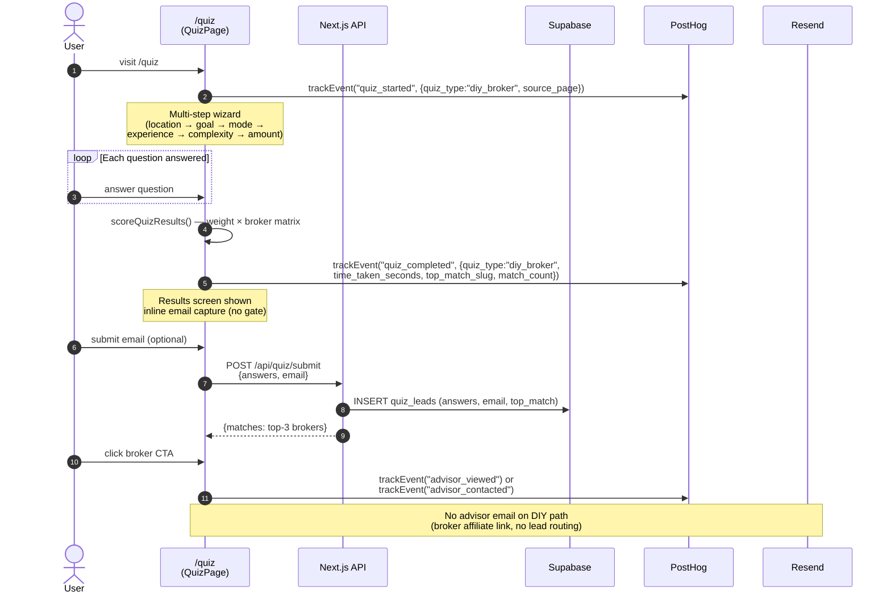
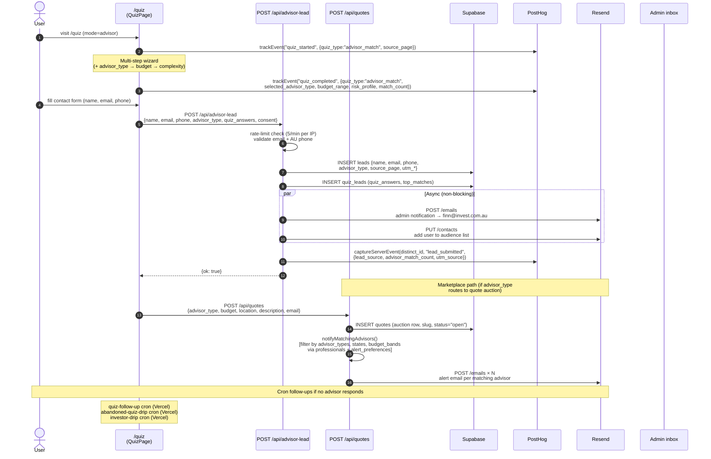
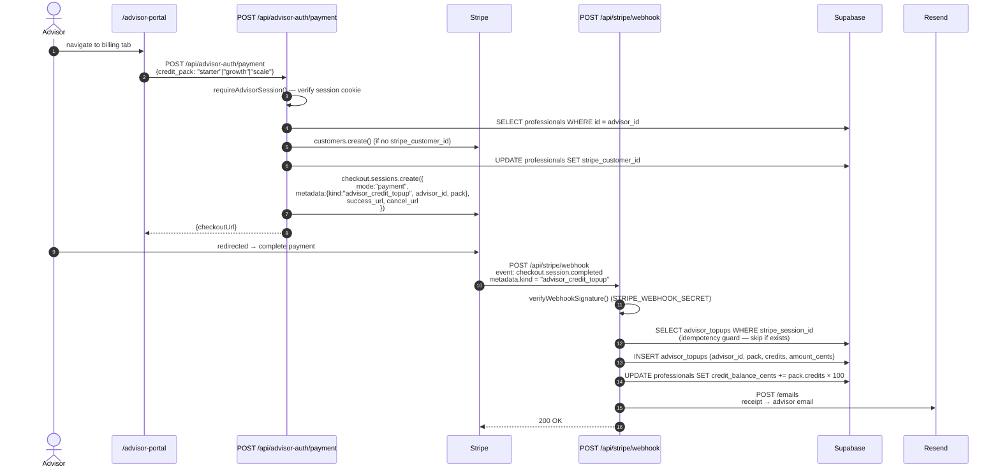
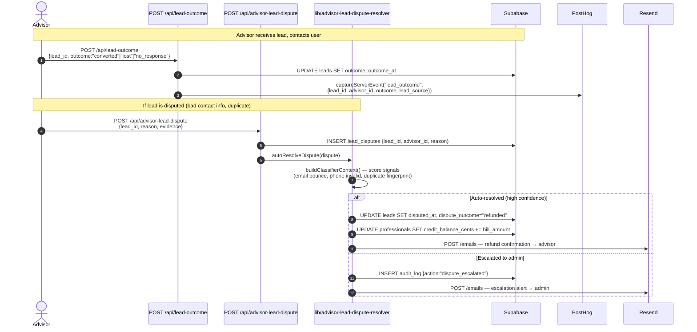

# User Journey — invest.com.au

Mermaid sequence diagram tracing the two primary user paths (DIY broker selection
and advisor matching) from landing through lead capture to billing and outcome.

Audit ref: `docs/audits/codebase-health-2026-04-24.md` §12  
Queue item: S-01  
Updated: 2026-05-07

---

## Path A — DIY broker quiz

---

## Path B — Advisor matching quiz

---

## Path C — Advisor billing (credit top-up)

---

## Path D — Lead outcome + dispute resolution

---

## PostHog event reference

| Event | Fired by | When |
|-------|----------|------|
| `quiz_started` | Browser (`phTrack`) | First question answered in `/quiz` |
| `quiz_completed` | Browser (`phTrack` + `trackEvent`) | Results screen mounted |
| `advisor_viewed` | Browser (`trackEvent`) | Advisor profile card clicked |
| `advisor_contacted` | Browser (`trackEvent`) | Contact button clicked |
| `lead_submitted` | Server (`captureServerEvent`) | `/api/advisor-lead` success |
| `advisor_response` | Server | Advisor bids on a quote |
| `lead_outcome` | Server | `/api/lead-outcome` success |

---

## Resend email touchpoints

| Trigger | Template | Recipient |
|---------|----------|-----------|
| `POST /api/advisor-lead` success | Admin notification (HTML, inline) | `finn@invest.com.au` |
| `POST /api/advisor-lead` success | Contact sync (audience list) | User |
| Advisor quote alert | Quote notification (lib/quote-emails) | Each matching advisor |
| `checkout.session.completed` — advisor_credit_topup | Credit receipt | Advisor |
| `checkout.session.completed` — course | Course receipt (buildCourseReceiptEmail) | Buyer |
| `checkout.session.completed` — consultation | Consultation confirmation | Buyer |
| Auto-resolved dispute | Refund confirmation | Advisor |
| Escalated dispute | Escalation alert | `finn@invest.com.au` |
| `cron/quiz-follow-up` | Follow-up if no advisor response | User |
| `cron/abandoned-quiz-drip` | Drip sequence (Day 1/3/7) | User |
| `cron/investor-drip` | Investor journey drip | User |

---

## Stripe webhooks consumed

| Event | Handler | Effect |
|-------|---------|--------|
| `checkout.session.completed` — `kind=advisor_credit_topup` | `handleCheckoutSessionCompleted` | Insert `advisor_topups`, add credits, send receipt |
| `checkout.session.completed` — `kind=advisor_featured` | `handleCheckoutSessionCompleted` | Activate 30-day featured status |
| `checkout.session.completed` — `type=course` | `handleCheckoutSessionCompleted` | Insert `course_purchases`, track creator revenue |
| `checkout.session.completed` — `type=consultation` | `handleCheckoutSessionCompleted` | Upsert consultation booking |
| `checkout.session.completed` — `kind=sponsored_placement` | `handleCheckoutSessionCompleted` | Create placement booking |
| `customer.subscription.*` | `handleSubscription*` handlers | Update subscription status in DB |
| `invoice.payment_succeeded` | `handleInvoicePayment` | Record payment, send receipt |
| `wallet_topup` | `/api/marketplace/webhook` | Broker wallet top-up (separate endpoint, prevents double-credit) |

---

## Key data tables

| Table | Written by | Purpose |
|-------|-----------|---------|
| `quiz_leads` | `/api/quiz/submit`, `/api/advisor-lead` | Quiz answers + top broker matches |
| `leads` | `/api/advisor-lead` | Advisor lead contact details + UTM |
| `quotes` | `/api/quotes` | Marketplace auction rows |
| `professionals` | Seed + admin + billing webhook | Advisor profiles + credit balance |
| `advisor_topups` | Stripe webhook | Credit purchase ledger (idempotency key) |
| `lead_disputes` | `/api/advisor-lead-dispute` | Dispute records |
| `audit_log` | Dispute resolver + admin actions | Immutable action log |
| `cron_run_log` | Every cron route | Heartbeat for staleness detection |
